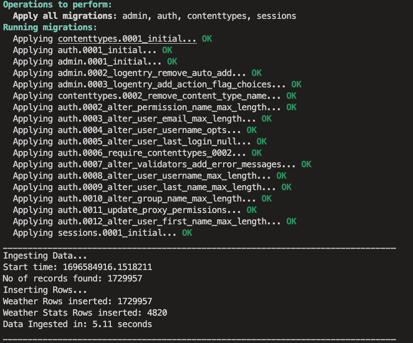
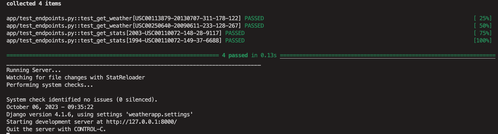
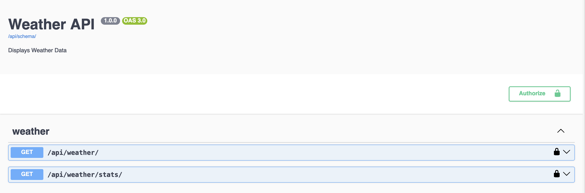
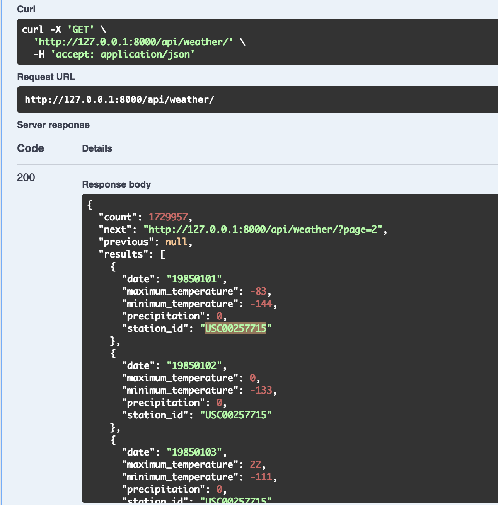
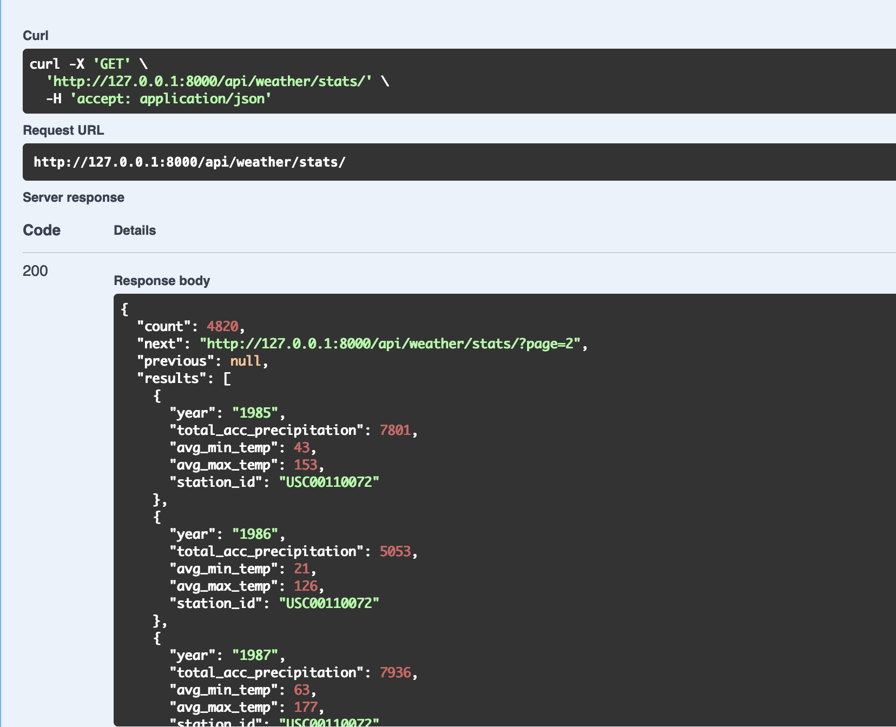

# Weather API with Django

This is a Django-based Weather API that provides weather data to users. It includes instructions on how to set up a virtual environment, install the required dependencies, run migrations, and ingest data. Additionally, it offers information on how to access and use the API.

The API endpoints provide access to the following functionalities:

    /api/weather - retrieves weather data
    /api/weather/stats - provides statistics about the data
    /api/schema/swagger-ui/ - Swagger UI that provides an overview of the API's capabilities.

## Prerequisites

The following prerequisites are required to use this API:

    Python (3.7 or higher)
    SQLite (or PostgreSQL if deploying to AWS)
    AWS account (if deploying to AWS)

## Installation and Usage

A Bash script has been created, which is responsible for installing requirements, ingesting data, making and applying migrations, running tests and then running the server.

```bash
    chmod +x setup_and_run.sh

    For Mac:
    ./setup_and_run.sh

    For Windows:
    bash ./setup_and_run.sh
```

### To access the API endpoints, use the following links:

    http://127.0.0.1:8000/api/weather
    http://127.0.0.1:8000/api/weather/stats
    http://127.0.0.1:8000/api/schema/swagger-ui/

# AWS Deployment

- Deploy Django API with AWS Elastic Beanstalk
- Deploy the Database with Amazon RDS
- Store Data with AWS S3
- Schedule Data Ingestion with AWS Lambda and Amazon EventBridge
- Store ingested data in the RDS database or S3 buckets, depending on your application's data architecture and requirements.

# Conclusion

- Scalable, secure, and easily managed deployment
- AWS Elastic Beanstalk handles Django application deployment, scaling, and load balancing
- Amazon RDS provides managed relational database service
- AWS S3 serves as an object storage service for media files and assets
- Use AWS Lambda and EventBridge for event-driven data ingestion scheduling
- Flexibility to store ingested data in RDS or S3
- Implementation of load balancing and auto-scaling for performance and reliability

# Screenshots





